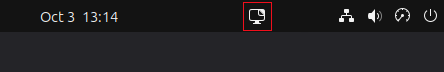

# Wallpaper Switcher

<p align="center">
  
  <br/>
</p>

A Gnome extension to change wallpapers after given interval of time.

## GNOME 46, 48 and 50 fork

This is a fork of [WallpaperSwitcher](https://github.com/rishuinfinity/WallpaperSwitcher)
maintained by Meekser.

This fork updates the extension for GNOME Shell versions 46, 48 and 50,
and adds a panel indicator for quick access to the extension preferences.

Original project:
https://github.com/rishuinfinity/WallpaperSwitcher


## Table of Contents

- [Wallpaper Switcher](#wallpaper-switcher)
  - [Table of Contents](#table-of-contents)
  - [Screenshots](#screenshots)
  - [Features](#features)
  - [Getting Started](#getting-started)
    - [Prerequisite: Install Gnome Tweaks](#prerequisite-install-gnome-tweaks)
    - [Prerequisite: Install Gnome Extensions Manager or Gnome Extensions](#prerequisite-install-gnome-extensions-manager-or-gnome-extensions)
      - [Setting Up Gnome Extensions Manager](#setting-up-gnome-extensions-manager)
      - [Setting Up Gnome Extensions](#setting-up-gnome-extensions)
    - [Install Wallpaper Switcher from source](#install-wallpaper-switcher-from-source)
  - [Contributing](#contributing)
  - [License](#license)

## Screenshots
<p align="center">
  
  <br/><br/>
  
  <br/>
  

</p>
<!-- 


 -->

<!-- ## Updates

The new release packs the following new features.

* Added settings for more customization options.
  * You can now choose which side you want your widget to be located.
  * Choose whow much to display 
  * Reset the data used info manually from settings
* Better implemented code. -->

## Features

This extension has following features:

* Easily set a folder containing wallpapers to apply
* Two available modes
  * Sequential : Wallpaper changes in a cyclic order
  * Random : Wallpaper changes in a random order
* Option to set time-delay in seconds
* Panel indicator for quick access to the extension preferences


## Getting Started

To use this extension, you will need

- Gnome 46 or later

### Prerequisite: Install Gnome Tweaks

For Ubuntu, Debian, Fedora: gnome-tweeks package.
For Arch: gnome-tweek-tool package

### Installation Wallpaper Switcher

1. Clone this repository

   ```bash
   git clone https://github.com/rishuinfinity/WallpaperSwitcher.git
   ```

2. Change current directory to repository

   ```bash
   cd WallpaperSwitcher
   ```

3. Now run

   ```bash
   chmod +x ./install.sh && ./install.sh
   ```
   
   If you are on Ubuntu wayland mode, then restart or logout and login.

4. Enable Wallpaper Switcher

   ```bash
   gnome-extensions enable WallpaperSwitcher@meekser
   ```

5. Check if enabled
   
   ```bash
   gnome-extensions info WallpaperSwitcher@meekser  
   ```

6. Enable Wallpaper Switcher extension in Gnome Tweaks or https://extensions.gnome.org/local/

## Contributing

Pull requests are welcome. For major changes, please open an issue first to discuss what you would like to change.

<!-- ## Thanks to

- This project is modified from [Internet Speed Meter](https://github.com/AlShakib/InternetSpeedMeter) by [Al Shakib](https://alshakib.dev) -->

## License

[GNU General Public License v3.0](LICENSE)

Copyright © 2026 [Meekser](https://github.com/meekser)
